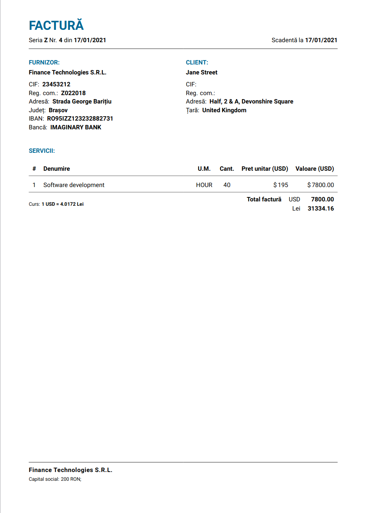

# Invoice

Currently geared towards Romanian invoices, and language is hardcoded to Romanian.
Items are capped at 1 row, but CSV support for multiple rows of items is planned.

## Building 

Getting the required dependencies is easy using Nix:

Drop into a `nix-shell`, which will contain all the required dependencies.

Tweak the invoice details in the `Makefile`, then run `make`. You'll get the resulting invoice inside `./invoices`.

You can also override parameters by doing `make CLIENTCOMPANY="Jane Street"`

Invoices are labeled according to the invoice number, which gets automatically incremented based on what the latest invoice number is.

## Preview

See [a sample invoice](sample/invoice.pdf).

